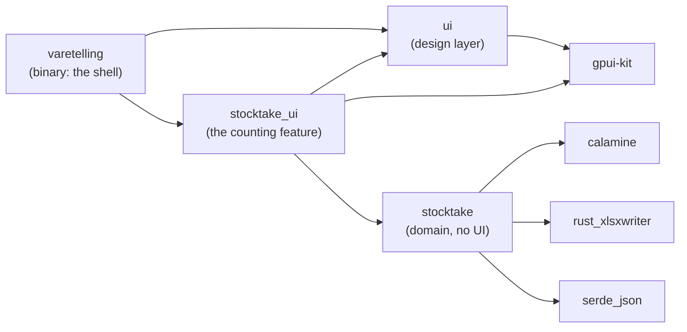

# Architecture

Scala Bad is a desktop app for the year-end stocktake (see [CONTEXT.md](../CONTEXT.md) for the vocabulary and [spec.md](spec.md) for the product). A counter imports the stock list exported from the business system (MultiCase, at Scala Bad) as an Excel file, scans each product's barcode, confirms or corrects how many units are on the shelf, and exports the counted list back to Excel. Every count is saved the moment it's made, so closing the app loses nothing.

It's written in Rust on [GPUI](https://www.gpui.rs/) through [gpui-kit](https://gpui-kit.com) 0.7, and follows the gpui-kit Coding Guides in `.agents/skills/gpui-kit`. There's no server or network: the only inputs are local files.

**Contents:** [From file to table](#from-file-to-table) · [Crates](#crates) · [State](#where-state-lives) · [Actions](#how-user-actions-change-state) · [Excel and files](#excel-and-other-files) · [Views, lifecycle and focus](#views-lifecycle-and-focus) · [Motion](#motion) · [Errors](#where-errors-are-handled) · [Adding a feature](#where-to-add-a-feature) · [Tests](#tests) · [Borrowed patterns](#patterns-borrowed-from-other-projects)

## From file to table

1. **Start.** `crates/varetelling/src/main.rs` initialises gpui-kit, calls `stocktake_ui::init` (key bindings), builds the menu bar (`menus.rs`), applies the theme (`theme.rs`) and opens one window whose root view is `StocktakeView`.
2. **Resume or welcome.** `StocktakeView::with_store_path` (`crates/stocktake_ui/src/stocktake_view.rs`) loads the saved stocktake with `stocktake::store::load`. If there is one, it opens it for counting; if not, the window shows the `Welcome` screen (`welcome.rs`) with the recent stock lists.
3. **Choose a file.** Cmd/Ctrl-O, the menu, the welcome's "Åpne fil", dropping a file on the window, or a recent file all end in `import_stock_list` (`stocktake_view/files.rs`). It first asks before discarding a stocktake that has counts in it.
4. **Read it in the background.** `read_file` runs `stocktake::stock_list::read` on the background executor. That function validates the workbook and returns `Vec<Product>` or an `ImportError`.
5. **Open it.** `finish_import` wraps the products in a `Stocktake`, puts that in a `Session` entity (`session.rs`), and calls `open_stocktake`. That creates the search field, the `DataTable` with its `ProductTable` delegate (`product_table.rs`), and the subscriptions between them. The session is saved straight away and the file joins the recent list.
6. **Count.** A scan types into the search; Enter runs `Stocktake::lookup`, selects the row and opens the count dialog (`count_dialog.rs`). Enter in the dialog calls `Session::record_count`, which saves to disk. Focus then returns to an empty search, and the counted row scrolls into view and flashes (`stocktake_view/counting.rs`).
7. **Export.** Cmd/Ctrl-E writes a snapshot through `stocktake::export::write`, again in the background.

## Crates



| Crate | Path | Owns | Must not |
| --- | --- | --- | --- |
| `stocktake` | `crates/stocktake` | Products and counting rules, reading the stock list, export, saving, the recent list | Depend on GPUI, or word anything for the counter |
| `ui` | `crates/ui` | Motion, typography, focus styling, small presentational components, the logo | Know what a stocktake is |
| `stocktake_ui` | `crates/stocktake_ui` | The counting window: model entity, workflow, screens, dialogs, Norwegian copy | Reach into the shell |
| `varetelling` | `crates/varetelling` | `main`, window options, theme colors, menu bar | Contain feature logic |

Why split at all? `cargo test -p stocktake` builds without GPUI and runs in about a second, which makes it the fast loop for import and counting rules. The compiler also enforces the boundaries: `stocktake` has no UI dependency, so it can't reach a view by accident. A crate isn't created per screen, though. `stocktake_ui` holds the whole counting feature because its pieces change together.

Conventions:

- Each crate root is named after the crate (`[lib] path = "src/ui.rs"`), as in Zed.
- Dependency versions are declared once in the workspace `Cargo.toml`, and crates opt in with `name.workspace = true`.
- `stocktake_ui`'s public seam is only `init`, its actions, `APP_NAME` and `StocktakeView` (see `stocktake_ui.rs`).
- `ui` re-exports every component flat (`ui::RowButton`, not `ui::components::row_button::RowButton`), and `ui::prelude` holds what nearly every view file needs.

### Modules in the feature crate

```text
crates/stocktake_ui/src/
├── stocktake_ui.rs        the seam: actions, key bindings, init()
├── session.rs             Session: the stocktake in progress, saved on every count
├── stocktake_view.rs      StocktakeView: state, lifecycle, focus, actions, main pane
│   └── stocktake_view/
│       ├── counting.rs    scan → count dialog → saved count → next scan
│       ├── files.rs       import (file dialog, drop, recent), export
│       ├── sidebar.rs     status and aisle filters, starting over, hiding and resizing the sidebar
│       └── tests.rs       UI integration tests of the window
├── product_table.rs       ProductTable: the DataTable delegate (rows, sorting, cells)
├── count_dialog.rs        the count dialog, and what counts as a quantity
├── welcome.rs             Welcome: the screen before a stock list is imported
├── count_status.rs        CountStatus: "Telt" / "Ikke telt" marker
└── path_display.rs        file names and ~-shortened folders
```

`StocktakeView` is one type spread over several files, the way Zed splits `Editor`. Child modules can see the parent's private fields, so nothing is made public just to split a file.

## Where state lives

| State | Owner | Lives as long as |
| --- | --- | --- |
| Products and counts | `Stocktake` (domain value) inside `Session` | The stocktake |
| Whether the last save succeeded | `Session::save_state` | The stocktake |
| Search text | `OpenStocktake::search` (`Entity<InputState>`) | The stocktake |
| Status and aisle filters | `OpenStocktake::filter` (`stocktake::Filter`) | The stocktake |
| Rows shown, sort, column widths, last-counted flash | `ProductTable` inside `OpenStocktake::table` | The stocktake |
| The product being counted and its quantity field | `OpenStocktake::count` (`Count`) | One open count dialog |
| Recent stock lists | `StocktakeView::recent` | The window |
| Sidebar hidden | `StocktakeView::sidebar_collapsed` | The window |
| Sidebar width | `StocktakeView::sidebar_width` | The window (not saved between launches) |
| Aisle filter closed | `StocktakeView::aisle_filter_collapsed` | The window |
| Read in progress | `StocktakeView::import_task` | One import |
| Hover/focus of a row button | GPUI keyed element state (`RowButton`) | The element |

The central rule is that **everything tied to one stocktake lives in `OpenStocktake`**. `StocktakeView::open` is `Option<OpenStocktake>`, so importing a new list or pressing "Tøm varetelling" drops all of it at once. Nothing has to be reset by hand, and no field can outlive the stocktake it describes.

`Session` (`session.rs`) is the model. It's an `Entity` because more than one party reads it: the view, the table delegate and the status bar. Its methods are the only way counts change, and every change is saved before the method returns, so **a stocktake that looks saved is saved**. Views read it with `session.read(cx).stocktake()`. `StocktakeView` observes it (`cx.observe`), so a count re-renders the table and status bar, and subscribes to `SessionEvent::SaveFailed` to show a notification.

`Stocktake` itself (`crates/stocktake/src/stocktake.rs`) is a plain value with no GPUI in it. `ProductId` is a product's line in the stock list. It's stable for the whole stocktake, so it keys UI state such as row identity and the flash. Item numbers aren't used because the business system can list one item number on several lines.

## How user actions change state

Commands are GPUI actions declared in `stocktake_ui.rs` and handled in `StocktakeView`'s `render`. The menu item, the key binding, the welcome button and the tooltip all go through the same action, so a shortcut can't disagree with its button.

| Action | Keys | Handler | Available |
| --- | --- | --- | --- |
| `ImportStockList` | Cmd/Ctrl-O | `files.rs` `import_stock_list` | Always |
| `ExportStocktake` | Cmd/Ctrl-E | `files.rs` `export_stocktake` | With a stocktake |
| `FocusSearch` | Cmd/Ctrl-F | `counting.rs` `focus_search` | With a stocktake |
| `ToggleSidebar` | Cmd/Ctrl-B | `sidebar.rs` `toggle_sidebar` | With a stocktake |
| `FocusNext` / `FocusPrevious` | Tab / Shift-Tab | `move_focus` | Always; skips the table |
| `Quit` (shell) | Cmd/Ctrl-Q | `main.rs` | Always |

When an action has no handler on the focused path, GPUI disables its menu item too. That's why export, search and the sidebar shortcut are registered only `.when(is_open, …)`.

The counting loop (`stocktake_view/counting.rs`):

```text
search Enter ──► find_product ──► Stocktake::lookup
                                   ├─ Found ───► select_product ──► table SelectRow ──► begin_count ──► count dialog
                                   ├─ Ambiguous ► (table already shows the choices)
                                   └─ NotFound ─► alert, search text selected for the next scan
count dialog Enter ──► save_count ─┬─ text is a listed barcode ─► take_scan_from_quantity: close, count that product next
                                   └─ a quantity ─► Session::record_count (saves) ──► finish_count ──► reveal_counted
Escape / Avbryt ──► dismiss_count ──► finish_count (nothing saved)
```

The scan guard (`take_scan_from_quantity`) exists because a scanner types and then presses Enter. If the counter scans the next product while a dialog is open, the barcode would otherwise be saved as billions of units.

`count_dialog::open` only collects the quantity. It takes `on_save` and `on_cancel` callbacks and knows nothing about the view that opened it.

## Excel and other files

All file formats live in the `stocktake` crate. Its functions are synchronous and return their own error types; `stocktake_ui` decides what runs in the background and how errors are worded.

### Reading the stock list (`crates/stocktake/src/stock_list.rs`)

The input is the business system's export, used as-is:

- **Format:** `.xlsx`, `.xlsm` or `.xls` (`stock_list::EXTENSIONS`, checked with `is_supported`). The same check decides which dropped file is accepted.
- **Sheet:** the first sheet. Its first row is the header row.
- **Columns:** found by header name, case-insensitively, wherever they are (`stock_list::column`). All other columns are ignored.

  | Header | Becomes | Notes |
  | --- | --- | --- |
  | `VareNR` | `Product::item_number` | A row without one is skipped (exports end in blank lines) |
  | `ProduktDesc1` | `Product::name` | |
  | `PrdEAN` | `Product::barcode` | May be empty; such products are found by typing |
  | `Lokasjon` | `Product::location` | May be empty; its leading letters are the aisle |
  | `FysiskPaaLager` | `Product::system_quantity` | Whole number, may be negative; empty means 0 |

- **Cells:** read as trimmed text. Whole numbers lose their `.0`, so an item number or barcode stored as a number reads the same as one stored as text.

Validation failures are `ImportError` variants: `NotFound`, `UnsupportedFormat`, `Unreadable` (damaged, or not really a workbook), `MissingColumns` (lists every missing header), `InvalidQuantity { row, value }` (the spreadsheet's own 1-based row number), and `Empty`. Their `Display` is English, for developers. `import_error_message` in `stocktake_view/files.rs` words each one for the counter in Norwegian.

### Searching and ordering (`crates/stocktake/src/stocktake.rs`)

- `Stocktake::search_filtered` returns products matching the search and the status and aisle filters, ordered the way the storage is walked: by location with natural number order (`C4-9` before `C4-10`), unlocated products last.
- `Stocktake::lookup` resolves a scan or typed text to one product. An exact barcode or item number wins over partial matches, so a scan never lands on a product that merely contains the digits.
- Column sorting in the table is presentation, so it lives in `ProductTable::apply_sort`. Uncounted products stay at the bottom of the counted and difference columns in both directions.

### Saving and resuming (`store.rs`, `recent.rs`)

- The stocktake in progress is JSON at `store::default_path()`: the platform data directory, then `Varetelling/varetelling.json` (on macOS, `~/Library/Application Support/Varetelling/`). It's written to a temporary file and renamed over the old one, so a crash mid-write keeps the previous save.
- The five most recent stock lists are kept in `recent.json` beside it. Losing them costs a trip to the file dialog, so failures to save them are ignored on purpose.

### Exporting (`export.rs`)

`export::write` writes the stock list in walking order with the business system's own headers, plus `Telt antall` and `Differanse`. Uncounted products are marked `Ikke telt` and highlighted. The view exports a clone of the stocktake taken when the save dialog opens, so counting can continue while the file is written.

## Views, lifecycle and focus

```text
Root (gpui-kit; added by open_window: dialogs, notifications)
└── StocktakeView                         key context "Stocktake", the window's focus handle
    ├── Sidebar (only with a stocktake)   ui::Sidebar parts, sidebar.rs
    │   └── WindowBar · app name · status and aisle checkboxes · "Tøm varetelling" (SidebarItem → RowButton)
    └── main pane
        ├── WindowBar                     traffic lights when the sidebar is hidden, search field
        ├── DataTable(ProductTable)       with a stocktake
        │   or Welcome                    without one (RowButton rows)
        └── status bar                    progress and save state, with a stocktake
```

- **Entities vs. values.** Only things with state across frames are entities: `StocktakeView`, `Session`, the two `InputState`s and the `TableState`. Everything else (`Welcome`, `CountStatus`, the `ui` components) is `RenderOnce`, rebuilt from values each frame.
- **Subscriptions are owned by what they serve.** Those on the search, table and session are stored in `OpenStocktake::_subscriptions` and end with it. The count field's subscription lives in `Count`. The window-bounds observer, which refits the product column, lives on the view. The shell's appearance observer is detached because it lasts as long as the window.
- **Async work** runs on the background executor and returns through a `WeakEntity`, so a closed window just drops the result. `import_task` holds the read in progress, and starting another import replaces (cancels) it, so the last file chosen wins.
- **Focus.** The view's own `FocusHandle` keeps shortcuts working when no control has focus. Opening a stocktake focuses the search. The count dialog's field is focused with `defer_in` because the dialog takes focus for itself first. Tab skips the table (`move_focus`), and hiding the sidebar moves focus off the button that disappears. A row that's a button (`ui::RowButton`) keys its focus handle by element id and builds it with `.tab_stop(true)`: GPUI ignores an element's `tab_index` when a handle is passed to `track_focus`.
- **Identity.** Table rows are keyed by `ProductId::line()` and recent files by their path, never by position, so animation and focus follow the item through filtering and reordering.
- **Layout.** The window opens maximized. The layout is flat and edge to edge (a visual reference to [tty7](https://github.com/l0ng-ai/tty7)), and the product column takes whatever width the fixed columns leave (`fit_columns`). The sidebar can be resized by dragging its trailing edge, between 200 and 400 px, and a double-click on the edge resets it to 256 px. Its width is a fixed number of pixels the view owns, not a share of the window, so maximizing the window doesn't widen it. The drag uses GPUI's own `on_drag` and `on_drag_move` (`DraggedSidebar` in `sidebar.rs`) rather than gpui-kit's `h_resizable`, which rescales panels by percentage when the window resizes and emits no event the product column could be refitted on.

### Motion

The app animates only to explain a change, and nothing runs at rest. Its own code has two animations, both in `crates/ui/src/styles/motion.rs`:

| Animation | Where | When it runs | How long |
| --- | --- | --- | --- |
| `ui::Appear`: fades and rises a region into place | The welcome's logo, "Kom igang" and "Nylig åpnet" (`welcome.rs`), 70 ms apart | The first time the welcome renders | The theme's `duration_slow` |
| `ui::flash`: a green pulse behind a row that fades out | The counted product's row (`ProductTable::render_tr`) | Right after a count is saved | 1.4 s (`FLASH_DURATION`) |

- **No idle redraws.** Both ask GPUI for another frame (`request_animation_frame`) only while they're running. Once the welcome has arrived or the flash has faded, the window stops redrawing until something changes.
- **Built on gpui-base's motion primitives** (`Presence`, `Timing`, `Keyframes`), not raw `with_animation`. They read durations and easing from the theme's motion tokens, so every animation shares one timing.
- **Reduced motion.** With the system's Reduce motion setting on, the welcome appears in its final state and rows don't flash. The flash is therefore never the only sign of a count: the row's counted quantity, difference and status change too.
- **The flash survives scrolling.** Its start time is stored in the table delegate (`LastCounted`), not in element state, because GPUI drops element state when a row scrolls away. A flash keyed to the row would replay each time it scrolled back in.

gpui-kit's components (dialogs, notifications, hover states) have their own small transitions. Those are the library's defaults, not something this app adds.

## Where errors are handled

| Failure | Detected in | Shown as |
| --- | --- | --- |
| Stock list can't be imported | `stock_list::read` → `ImportError` | Alert (`finish_import`). A missing file also leaves the recent list |
| Recent file moved or deleted | `open_recent` checks first | Alert; removed from the list, nothing discarded |
| Dropped file isn't a workbook | `on_drop_files` with `stock_list::is_supported` | Warning notification |
| Saved stocktake can't be resumed | `store::load` in `with_store_path` | Error banner on the welcome; the next import replaces the file |
| A count wasn't saved | `Session::save` → `SessionEvent::SaveFailed` | Sticky notification, and "Ikke lagret" in the status bar until a save succeeds |
| Discarding the saved stocktake failed | `Session::discard` | Error notification; the stocktake stays open |
| Export failed | `export::write` | Alert |
| Search matched nothing | `Stocktake::lookup` → `NotFound` | Alert; nothing is recorded |

Errors are never only logged: each reaches the counter in the window.

## Where to add a feature

- **A rule about products or counting** (e.g. a maximum plausible quantity): `crates/stocktake`, with a unit test there.
- **A new column read from the export:** a constant in `stock_list::column`, a field on `Product` (`#[serde(default)]` keeps old saves loading), a fixture test, then the column in `ProductTable` and perhaps `export::write`.
- **A new command:** add it to `actions!` in `stocktake_ui.rs`, bind it in `init`, handle it in `StocktakeView::render` (inside `.when(is_open, …)` if it needs a stocktake), and add a menu item in `crates/varetelling/src/menus.rs`.
- **Something that changes counts:** a method on `Session`, which saves, so the persistence guarantee holds.
- **Per-stocktake UI state:** a field on `OpenStocktake`, never on `StocktakeView`.
- **A new dialog:** a module like `count_dialog.rs` that takes callbacks. Its workflow goes in a `stocktake_view/` child module.
- **A look reused across the app:** a `RenderOnce` component in `crates/ui/src/components/`, re-exported flat. If it needs stocktake words, it belongs in `stocktake_ui` instead (as `CountStatus` does).
- **A second, unrelated capability** (say, a price list): a new feature crate beside `stocktake_ui`, composed by the shell.

## Tests

| Layer | Where | Proves |
| --- | --- | --- |
| Domain | `crates/stocktake/src/*.rs` | Import of the sample export and of generated workbooks (header order, numbers as text, blank rows, missing columns, bad quantities, empty, missing/damaged/unsupported files), search order, lookup, aisles, export, saving, damaged saves, recent list |
| Model | `crates/stocktake_ui/src/session.rs` | A count is saved at once; a failed save keeps the count, marks it unsaved and emits `SaveFailed` |
| UI integration | `crates/stocktake_ui/src/stocktake_view/tests.rs` | The real window, headless: importing a workbook (rejected, then accepted, saved and remembered); scan → count → saved → back to search; a scan into the count dialog; cancelling; Tab reaching the welcome's rows; hiding and showing the sidebar by click, shortcut and keyboard |
| Pure helpers | `count_dialog.rs`, `product_table.rs`, `path_display.rs` | Quantity parsing, uncounted-last sorting, folder display |

Run everything with `cargo test --workspace`; a plain `cargo test` only runs the default member (the shell). The UI tests use gpui-kit's `test-support` feature, enabled for `stocktake_ui`'s tests. `ui::RowButton` registers itself for them with `.test_support()`, which does nothing in normal builds.

`stock_list::tests::reads_the_sample_export` reads a real export, `data/Vareliste - varetelling.xlsx`, alongside the generated fixtures. `data/` also holds the screenshots of the projects in `INSPIRATION.md`.

## Patterns borrowed from other projects

Each pattern below was checked in the source of the project named. They were adopted at this app's scale: one window, one feature crate.

| Pattern | Where it comes from | Why it fits here |
| --- | --- | --- |
| UI-free domain crate under a feature crate under a thin shell | Zed's `project` under `project_panel`. [Coco MCP](https://github.com/camiloazula/coco-mcp) splits UI-free crates (`mcp-core`, `mcp-store`, …) from `apps/desktop` | Import, counting rules and saving are tested without GPUI, and the compiler keeps views out of them |
| A model entity the views read, with an event enum for what owners must react to | Zed's `ProjectPanel` holds `project: Entity<Project>` and `subscribe_in`s to `project::Event`. [Cadence](https://github.com/infomiho/cadence) has `Session` with `SessionEvent` (`src/app/session.rs`) | `Session` is read by the view, table and status bar, and reports `SaveFailed` the same way |
| The save outcome lives on the model, not the view | Coco MCP's `persistence.rs`: "a server that looks saved is saved", with the outcome on the model and shown in the status bar | `Session::save_state` drives "Lagret / Ikke lagret" and can't drift from what was written |
| One view type split across files by concern, with `pub(super)` handlers | Zed's [`crates/editor/src`](https://github.com/zed-industries/zed/tree/main/crates/editor/src) (`editor.rs` plus `actions.rs`, `element.rs`, …). Cadence's `src/app/actions.rs` is an `impl Workspace` block of `pub(super)` handlers | `StocktakeView` keeps private state while `counting.rs`, `files.rs` and `sidebar.rs` each read on their own |
| Actions namespaced per crate, bound in the feature's `init` | Zed's `actions!(project_panel, […])` and `project_panel::init` | `stocktake::ImportStockList` etc. are bound once and reused by the menu, keys and buttons |
| Shell modules for the menu bar and theme | Coco MCP's `apps/desktop/src/menus.rs` and `theme.rs` | `main.rs` stays a short bootstrap |
| Crate root named after the crate; `ui` with a prelude and flat re-exports; `styles/typography.rs` | Zed's `crates/ui` (`[lib] path = "src/ui.rs"`, `prelude`, `styles/typography.rs`) | Editor tabs say `ui.rs`, and moving a component never breaks an import |
| Components composed from named blocks, styled after Catalyst's (`Sidebar`, `SidebarHeader`, `SidebarItem`, `Dropdown`, `DropdownItem`, …) | [Catalyst](https://catalyst.tailwindui.com), Tailwind Plus's React kit (licensed, read from a local copy; not copied into this repo) | Call sites read like the layout they build. GPUI has no sibling selectors or subgrid, so containers space their children with a gap and rows use flex |

Zed's dock/pane/workspace machinery, settings system and global registries were deliberately not adopted. They solve problems of many windows, panels and plugins that this app doesn't have.
